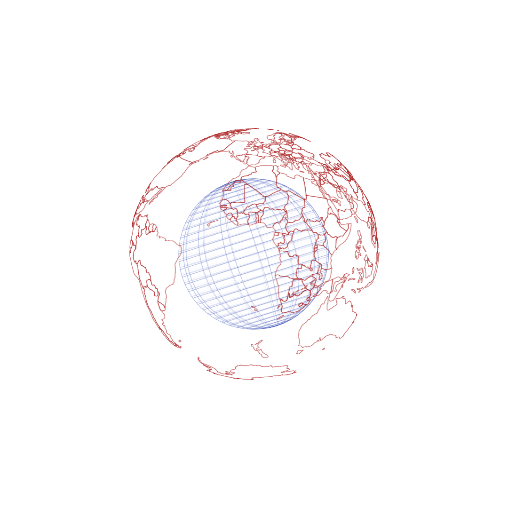

# JavaScript Canvas Sketch

These sketches showcase my skills in computer graphics and my passion for data visualization. The main goal of this project was to turn any idea of a 3D object into a visual on the screen using only JavaScript and the canvas tag. While I acknowledge the existence of libraries that make this process easier, I am always eager to understand how things work, and this challenge allowed me to dive deep into the concepts of linear algebra, linear transformations, and vector and matrix classes.

My inspiration for this project came from the Domestika course 'Creative Coding: Making Visuals with JavaScript.' As someone who has been working with data for a while, I consider data visualization to be highly valuable, and I knew that this course would enrich my understanding of how to use programming to create stunning visuals.

In addition to improving my understanding of linear algebra concepts, this project has also allowed me to experiment with generative art and programmatic design. I find these concepts fascinating, and I believe that they have the potential to solve some of the most challenging analytical problems.

## 3D World

The 3D World sketch is an example of how I can create and display data based 3-dimensional objects on the browser. The output showcases how the projection of the objects changes as the camera moves in different directions. 

Created with CodeSandbox. Link -> https://codesandbox.io/s/3d-world-0pec6e?file=/src/index.js:343-472

  

  

  

  

## Dancing Cubes

The Dancing Cubes sketch is another example of what can be created using JavaScript Canvas Sketch. It features a group of cubes that move in a choreographed dance. The images and GIFs below demonstrate some of the possible (or I would rather say infinite) views.

Created with CodeSandbox. Link -> https://codesandbox.io/s/dancing-cubes-ziibk8

  

  

  

Overall, I find the concepts of generative design and data visualization to be fascinating, and I am excited to continue exploring and developing my skills in these areas.